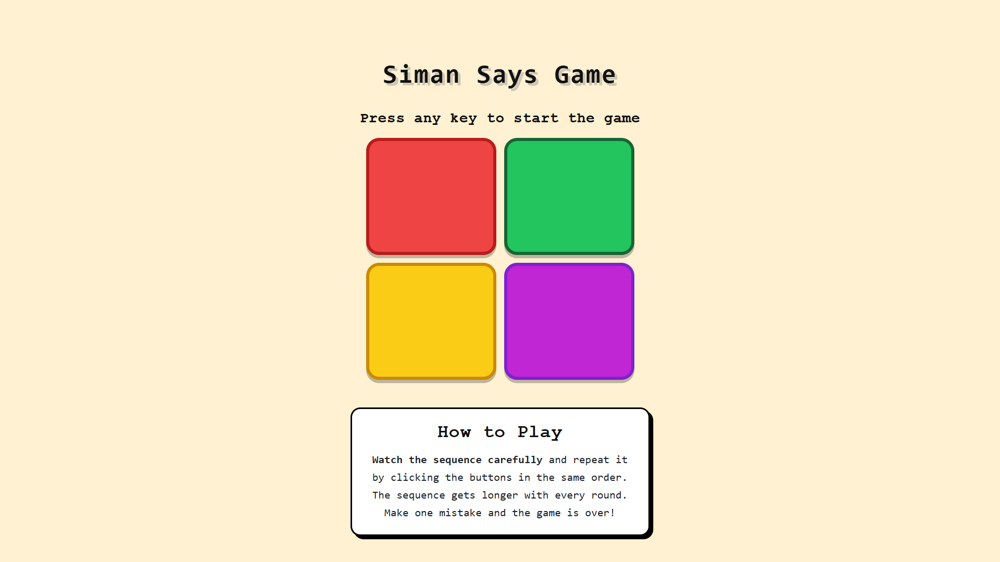

# Simon Says Game

A simple and interactive memory game built with vanilla HTML, CSS, and JavaScript.

### 🔗 Live Demo
[Simon Says Game →](https://simon-says-game-one-phi.vercel.app/)

## How to Play

Watch the sequence and repeat it in the same order.  
The sequence gets longer with every level. Make a mistake and the game is over.

## Tech Stack

HTML • CSS • JavaScript

## Author

Built with ❤️ by **Harsh**